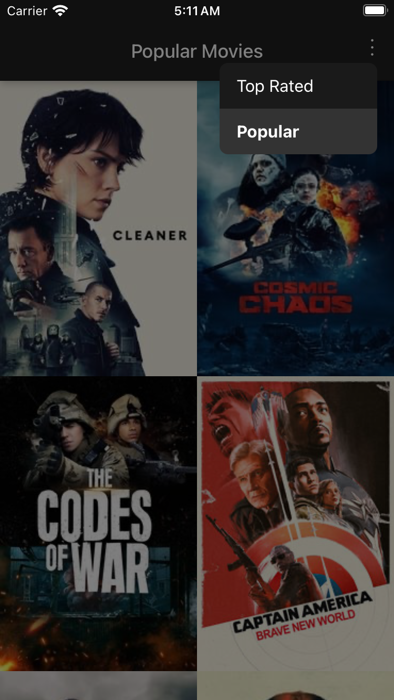
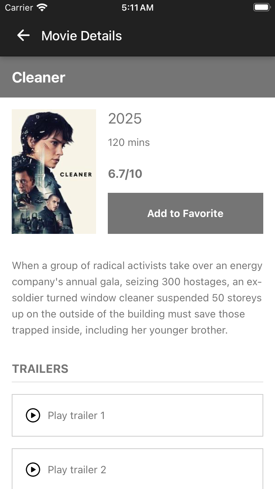

## Overview

Movie Discovery App is a React Native mobile application that allows users to browse and discover movies. The app fetches data from The Movie Database (TMDB) API and provides a clean, intuitive interface for exploring popular and top-rated movies.

## Features

- **Movie Discovery**: Browse through popular and top-rated movies
- **Category Switching**: Toggle between different movie categories
- **Movie Details**: View detailed information about each movie
- **Infinite Scrolling**: Load more movies as you scroll
- **Pull to Refresh**: Update the movie list with the latest data
- **Responsive Design**: Works on various screen sizes and orientations

## Screenshots

<p align="center">
  
  
</p>

## Technologies Used

- **React Native**: Core framework for building the mobile app
- **Expo**: Development platform for React Native
- **TypeScript**: For type-safe code
- **Expo Router**: For navigation between screens
- **React Native Reanimated**: For smooth animations
- **The Movie Database API**: For fetching movie data
- **Jest & React Native Testing Library**: For testing

## Prerequisites

- Node.js (v14 or newer)
- npm or yarn
- Expo CLI
- iOS Simulator or Android Emulator (optional for local development)

## Installation

1. Clone the repository:
   ```bash
   git clone https://github.com/yourusername/react-native-app.git
   cd react-native-app
   ```

2. Install dependencies:
   ```bash
   npm install
   # or
   yarn install
   ```

3. Create a `.env` file in the root directory with your TMDB API key:
   ```
   EXPO_PUBLIC_API_KEY=your_tmdb_api_key_here
   ```
   You can obtain an API key by creating an account at [The Movie Database](https://www.themoviedb.org/) and requesting an API key.

## Running the App

```bash
# Start the development server
npm start
# or
yarn start

# Run on iOS
npm run ios
# or
yarn ios

# Run on Android
npm run android
# or
yarn android
```

## Project Structure

```
├── app/                  # Main application code
│   ├── (tabs)/           # Tab-based navigation screens
│   ├── movie/            # Movie detail screens
│   └── __tests__/        # Tests for app screens
├── assets/               # Static assets (images, fonts)
├── components/           # Reusable UI components
│   └── __tests__/        # Component tests
├── constants/            # App constants and configuration
├── hooks/                # Custom React hooks
├── services/             # API services
│   └── __tests__/        # Service tests
├── types/                # TypeScript type definitions
└── utils/                # Utility functions
```

## API Integration

This app uses The Movie Database (TMDB) API to fetch movie data. The API integration is handled in the `services/api.ts` file. The app currently supports fetching:

- Popular movies
- Top-rated movies
- Movie details

## Testing

Run tests with:

```bash
npm test
# or
yarn test
```

## License

[MIT License](LICENSE)

## Acknowledgements

- [The Movie Database (TMDB)](https://www.themoviedb.org/) for providing the API
- [Expo](https://expo.dev/) for the excellent React Native development platform
- [React Navigation](https://reactnavigation.org/) for the navigation solution